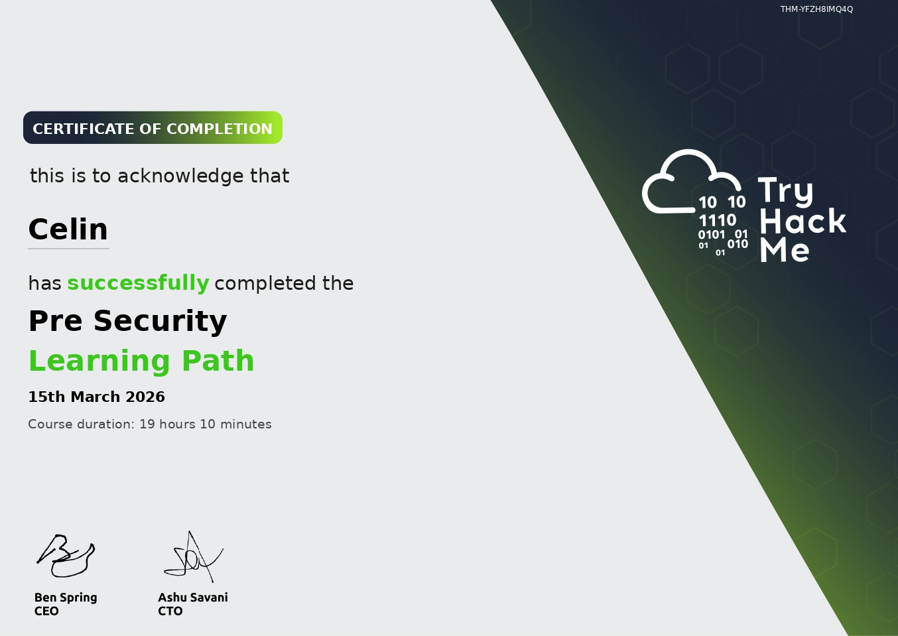

# Pre-University Cybersecurity

learning journey before uni starts 𝜗ৎ

## Platforms
- TryHackMe ( in progress )
- Youtube
- Portswigger web security academy

## Dragons Slayed


## . ˖  ꒰𑁬 NOTES ໒꒱  ˖ .

### Networking
- [Intro to LAN](intro-to-lan.pdf)
- [OSI](osi-models.pdf)
- [OS Security](OsSec.pdf)

  
## Repository Structure

```
cybersecurity-notes
│
├── README.md
│
└── networking
   ├── intro-to-lan.pdf
   └── osi_models.pdf
```
